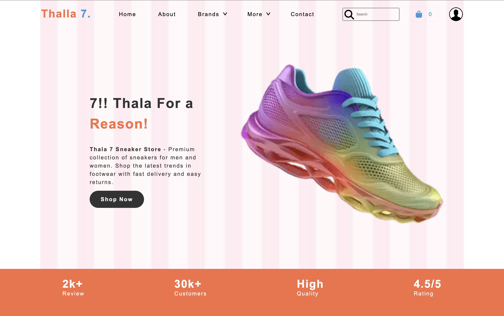
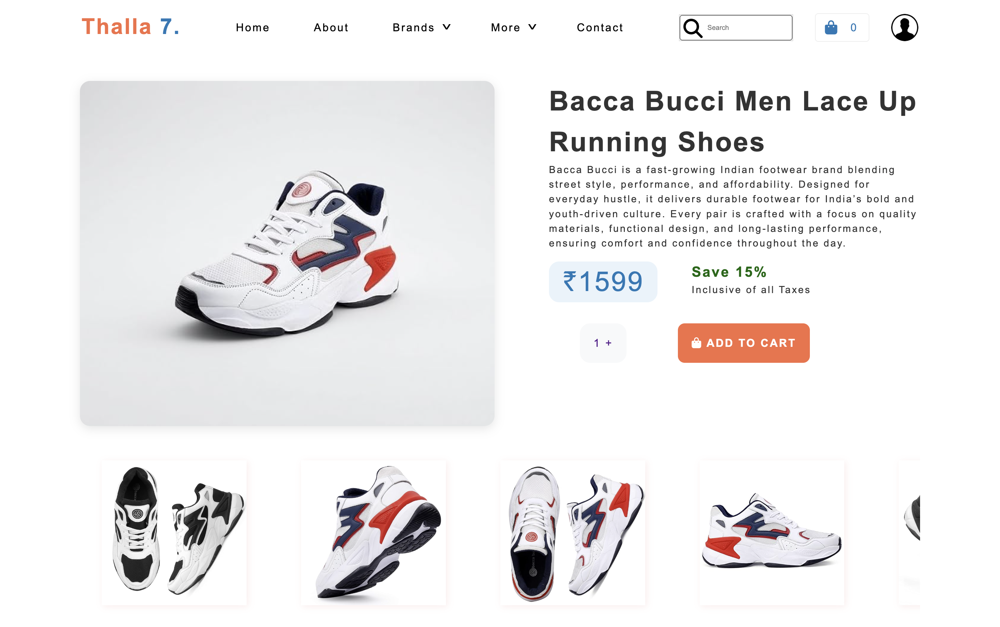

# Task: CSS Mini Project - Thala 7 Sneaker Store

**Problem Statement:** Design and implement a web application for a Sneaker Selling Store. Which have a landing page, Product Display Page, Shopping cart View page And a Payment page.

## **Tasks :**
### 1. Landing Page:

**Header :**

    • In the Navbar there is Logo on the left, some Menus in the centre and on the right side there is search icon, cart icon and profile picture.

    • Use FlexBox to make it properly aligned and well structured

**Hero Section :**

    • Create a hero section with two divs.

    • Left div : Heading, description, and a "Shop Now" button.

    • Right div : Display an image of Any Sneaker or Shoe from the internet.

**Service Overview Section :**

    • Design a section outside the main div with full width and some height.

    • Display the service achievements: 2k+Reviews, 30k+ customers, 4.5/5 rating, High Quality.

### 2. Product Display Section:

**Header :** Same as Landing page

**Main Display Section :**

    • On the Left show main image of product

    • On the right Shoe Product name, Description, Price, Sale details,Quantity section and Add to cart Button

**Bottom Gallery Section :**

    • Show All The images related to the Shoe in a Scrolling Container

    • Use Flex For Proper Structure

### 3. Shopping Cart Section:

**Header :** Same as Landing page

**Left container:**

    • Heading "Shopping Cart"

    • A table Showing Product, Quantity and Price with a remove icon.

**Right container:**

    • A Descriptive card showing input for coupon code to be applied, An Apply Coupon Button

        • Sub Total

        • Taxes

        • Discount

        • Total

    • Pay Now Button

    • Razorpay Icons to make it look Legit

**Bottom container:**
    
    • Continue Shopping Link in the bottom of left side of the page

### 4. Payment Section :

**Left container:**

    • Sub-Heading "Checkout" at the top of the page

    • An input field to get email from customers with a label Email ID.

    • Payment card Having Different Options to make Payments

        • On Top there will be options of selecting Pay via Cards, Crypto, Bank etc

        • Get Card Number Expiry cvv country and Zip code from input.

**Right container:**

    • "Order Summary" Heading

    • A Descriptive card showing input for coupon code to be applied, An Apply Coupon Button

        • Sub Total

        • Taxes

        • Discount

        • Total

    • Pay Now Button

    • Razorpay Icons to make it look Legit